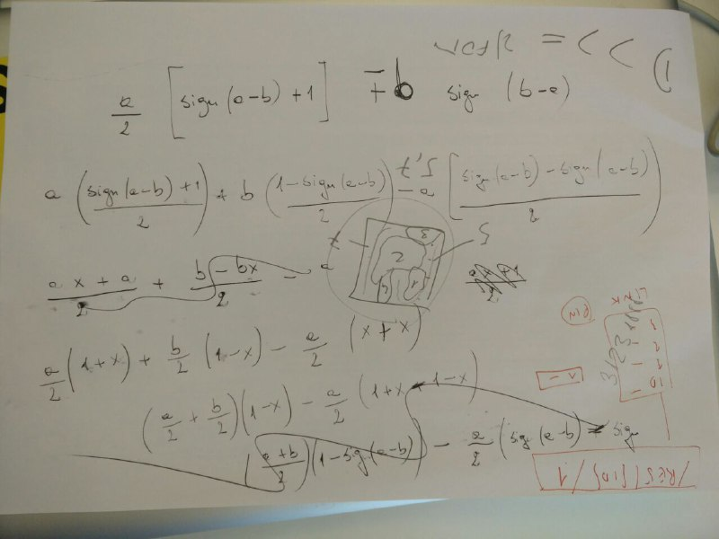

#1 - Il maggiore di due numeri, senza comparatori
#################################################

:date: 2017-09-19 08:30
:tags: code-game
:category: Code Games
:slug: maggiore-senza-comparatori
:authors: Arialdo Martini
:organizer: Arialdo Martini
:sommario:  Riusciresti a scrivere una funzione che trovi il massimo di due numeri senza mai usare un comparatore?

Trovare il maggiore di due numeri è banale:

.. code-block:: csharp

    public int Max(int a, int b)
    {
        return Math.Max(a, b);
    }

oppure:

.. code-block:: csharp

    public int Max(int a, int b)
    {
        if(a >= b) return a;
        else return b;
    }

Ma riusciresti a farlo senza mai usare un comparatore?
Niente ``>``, ``<``, ``==``, nessun ``if/then/else`` e nessuno ``switch``!

Ecco il testo::

    Write a function that takes 2 integers and returns the greater
    of them, or one of them if they are equal.
    You should not use comparators such as >, <, ==, Math.Max(), if, then,
    else, switch and the like.
        
    Example:
    
    Max(0, 0) => 0
    Max(10, 0) => 10
    Max(0, 10) => 10
    Max(-1, 0) => 0
    Max(-1, 1) => 1
    Max(-10, -1) => -1

Vince l'approccio più originale.

Se vuoi pubblicare una soluzione, fai una pull request sul repository  `https://github.com/TicinoXP/code-games <https://github.com/TicinoXP/code-games/blob/master/README.md>`_

Le nostre soluzioni
===================

Emanuele
--------

Emanuele ha trovato `una soluzione <https://github.com/TicinoXP/code-games/blob/master/1-maggiore-senza-comparatori/Arialdo/MaxWithoutComparators/Emanuele.cs>`_ che sfrutta il valore assoluto. Dal momento che::

          | + a if a >= 0
          |
    |a|  <
          |
          | - a if a < 0

``Math.Abs()`` può essere sfruttato per realizzare un ``if/else``. La sua soluzione è super concisa, e funziona sia con i numeri positivi che con quelli negativi:

.. code-block:: csharp

    public int Max(int a, int b) => (a + b + Math.Abs(a - b) ) /2;

Stefano
-------

A chi dovesse storcere la bocca all'idea di usare l'``if/else`` nascosto dentro il valore assoluto piacerà l'enhancement proposto da Stefano: usare la radice del quadrato come alternativa al valore assoluto, che porta a questa soluzione:

.. code-block:: csharp

     public int Max(int a, int b) => (a + b + Math.Sqrt(Math.Pow(a - b, 2))) / 2 ;

Raffaele
--------
Anche Raffaele ha trovato il modo di evitare l'uso del valore assoluto, e ha sfruttato il calcolo
del segno di un'espressione. La sua soluzione è `qui <https://github.com/TicinoXP/code-games/tree/master/1-maggiore-senza-comparatori/raffaele>`_

Era partito da questa formula:

.. code-block:: java

    public static void comparator(int a, int b) {
        return (a / 2) * (Math.signum(a - b) + 1) + b * Math.signum(b - a);
    }

ma poi, rendendosi conto che non funzionava nel caso in cui ``a`` e ``b`` fossero uguali,
l'ha elaborata così:

.. image:: images/max-without-comparators/appunti-raffaele.jpg

Tradotta in Java:

.. code-block:: java

     public int comparator(int a, int b) {
       return (int)
         (a * (Math.signum(a - b) + 1) / 2 +
         b * (Math.signum(b - a) + 1) / 2 -
         (Math.signum(a - b) + Math.signum(b - a)) / 2);
     }

che, opportunamente semplificata, è diventata:

.. code-block:: java

    public int comparator(int a, int b) {
        return (int) (a + b + Math.signum(a - b) * (a - b)) /2;
    }

Leonardo
--------

La soluzione di Leonardo sfrutta invece un trucco completamente diverso:

.. code-block:: csharp

    public int Max(int number1, int number2)
    {
      try
      {
        var result = number1 - number2;
        Convert.ToUInt32(result);

        return number1;
      }
      catch
      {
        return number2;
      }
    }

Un applauso per la fantasia!!!

Giuseppe Lombardi
-----------------

Un'altra soluzione davvero astuta e fantasiosa `la propone Giuseppe <https://github.com/beppel/code-games/tree/master/1-maggiore-senza-comparatori/MaggioreSenzaComparatori>`_: se si accodano in un array ``a`` ripetuto ``a`` volte e ``b`` ripetuto ``b`` volte, l'elemento al centro dell'array sarà il maggiore::

    a = 7
    b = 4

      0    1    2    3    4    5    6    7    8 
    =============================================
    | 7 | 7 | 7 | 7 | 7 | 7 | 7 | 4 | 4 | 4 | 4 |
    =============================================
                          ^
                        centro

Non è geniale?

Il codice è:

.. code-block:: csharp

   public short Max(short a, short b)
   {
       var list = new List<uint>();

       var uintA = (ushort)(short.MaxValue + a);
       for (var i = 0; i < uintA; i++)
           list.Add(uintA);

       var uintB = (ushort)(short.MaxValue + b);
       for (var i = 0; i < uintB; i++)
           list.Add(uintB);

       return (short)(list[((uintA + uintB) / 2)] - short.MaxValue);
   } 

L'uso di ``short.MaxValue`` è un altro trucco furbo per fare in modo che l'agoritmo funzioni
anche con i numeri negativi: sommando ai valori in ingresso ``short.MaxValue`` si traslano
tutti i casi nel dominio dei numeri positivi.

Arialdo
-------
Esiste una piccola variante della soluzione di Giuseppe: si inseriscono in un array ``a`` volte ``a``
e ``b`` volte ``b``, e poi si estraggono ``b`` elementi da sinistra; il successivo contiene il max::

    a = 7
    b = 4

      0    1    2    3    4    5    6    7    8 
    =============================================
    | 7 | 7 | 7 | 7 | 7 | 7 | 7 | 4 | 4 | 4 | 4 |
    =============================================
    <----------- a  ------------><------ b ----->
    <------ b -----> ^
                     max

Questa versione ha il vantaggio di poter essere implementata con una singola espressione LINQ:

.. code-block:: csharp

        public int Max(int a, int b)
        {
            return Enumerable.Repeat(a, a).Concat(Enumerable.Repeat(b, b).Skip(b).ToList()[0];
        }

Arialdo ha trovato `un secondo approccio <https://github.com/TicinoXP/code-games/blob/master/1-maggiore-senza-comparatori/Arialdo/MaxWithoutComparators/Arialdo.cs>`_, molto più convoluto e prolisso, e molto
meno efficiente.
L'idea è sfruttare il confronto tra bit e una funzione ricorsiva.

Si prendono i due numeri e li si traducono in binario::

    a = 1 1 0 1 0 1 0 1 0 1
    b =       1 1 1 0 0 1 1

Si aggiungono all'occorrenza dei trailing 0::

    a = 1 1 0 1 0 1 0 1 0 1
    b = 0 0 0 1 1 1 0 0 1 1

e si iniziano a confrontare i bit partendo da quelli più significativi: se un numero
ha il bit a 1 mentre l'altro lo ha a 0, è facile capire quale dei due sia maggiore:

.. code-block:: csharp

    public bool IsBigger(bool a, bool b) => a && !b;

Se i due bit sono uguali

.. code-block:: csharp

    public bool AreEqual(bool a, bool b) =>  a && b || (!a && !b);

si deve procedere ricorsivamente.

Il problema della ricorsione è che ha bisogno di valutare la condizione di uscita,
altrimenti non terminerebbe mai.
Mentre è facile calcolare la condizione di uscita (non devono esserci altri numeri da valutare):

.. code-block:: csharp

    public static bool ThereAreOtherItems(List<bool> ab) => ToBoolean(ab.Count());

è un po' più difficile valutarla, perché richiederebbe un ``if``. Il trucco è sfruttare
la *short-circuit evaluation* degli operatori booleani: in pratica, in un ``or`` il secondo
elemento non viene valutato se il primo è già ``true``.
L'algoritmo che ne risulta è:

.. code-block:: csharp

   public bool AIsBigger(List<bool> ab, List<bool> bb)
   {
        var headA = ab.First();
        var headB = bb.First();
        var tailA = ab.Skip(1).ToList();
        var tailB = bb.Skip(1).ToList();
        var aIsBigger = IsBigger(headA, headB);
        var areEqual = AreEqual(headA, headB);
        var thereAreOtherItems = ThereAreOtherItems(tailA);
        return 
           (
               aIsBigger
           )
           || 
           (
               areEqual
               && 
               (
                   (thereAreOtherItems && AIsBigger(tailA, tailB))
                   || 
                   !thereAreOtherItems
               )
           );
    }

Fa schifo, ma funziona!
