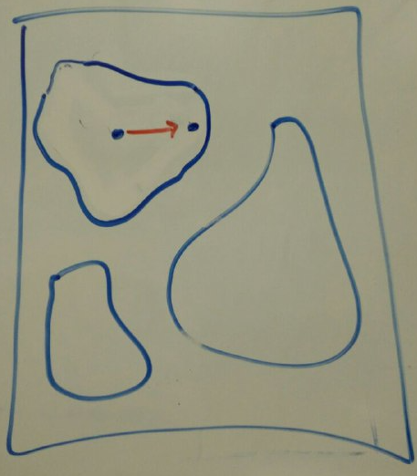
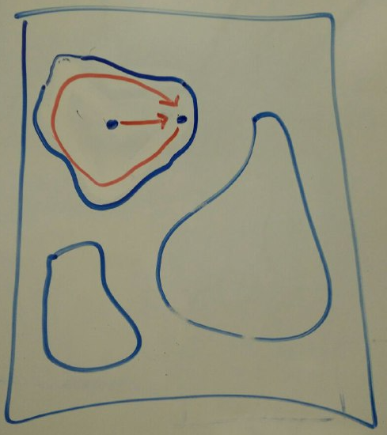

#2 - Pond Sizes
###############

:date: 2017-09-19 10:00
:tags: code-game
:category: Code Games
:slug: pond-sizes
:authors: Arialdo Martini
:organizer: Arialdo Martini
:sommario:  Ecco una nuova sfida: un algoritmo per calcolare le area degli "*stagni*" contenuti in una matrice di interi.

Ecco il quesito::

    Pond Sizes
    ----------
    You have an integer matrix representing a plot of land, where the
    value at that location represents the height above sea level.
    A value of 0 indicates water. A pond is a region of water connected
    vertically, horizontally, or diagonally.
    The size of the pond is the total number of connected water cells.

    Write a method to compute the sizes of all the ponds in the matrix.

    Example:

    Input:

       0 2 1 0
       0 1 0 1
       1 1 0 1
       0 1 0 1

    Output:

       1, 2, 4

Se vuoi pubblicare una soluzione, invia una pull request al repository  `https://github.com/TicinoXP/code-games <https://github.com/TicinoXP/code-games/blob/master/README.md>`_

Le nostre soluzioni
===================

Alessandro
----------

Ale ha battuto tutti sui tempi e, non contento della velocità, ha pure pubblicato due soluzioni. La sua `prima soluzione <https://github.com/TicinoXP/code-games/pull/3>`_ ruota intorno a questo snippet:

.. code-block:: csharp

    for (int r = 0; r < width; r++)
    for (int c = 0; c < height; c++)
    {
      var size = CountCells(pond, mark, r, c);
      if (size > 0)
        result.Add(size);
    }

    return result.Sort();

``CountCells`` contiene il cuore della sua soluzione. È una funzione ricorsiva che esplora l'area intorno a una cella, segnando in un accumulatore le celle visitate, in modo da realizzare la condizione di terminazione:

.. code-block:: csharp

    public int CountCells(int[,] pond, bool[,] yetMarked, int r, int c)
    {
        if (r >= pond.GetLength(0) || r < 0 ||
            c >= pond.GetLength(1) || c < 0)
          return 0;

        if (yetMarked[r, c])
          return 0;

        yetMarked[r, c] = true;
          if (pond[r, c] != 0)
            return 0;

        return 1 +
          CountCells(pond, yetMarked, r + 1, c) +
          CountCells(pond, yetMarked, r + 1, c + 1) +
          CountCells(pond, yetMarked, r, c + 1) +
          CountCells(pond, yetMarked, r - 1, c + 1) +
          CountCells(pond, yetMarked, r - 1, c) +
          CountCells(pond, yetMarked, r - 1, c - 1) +
          CountCells(pond, yetMarked, r, c - 1) +
          CountCells(pond, yetMarked, r + 1, c - 1);
    }

L'idea è brillante e non fa una piega: si visitano i punti della matrice uno per uno. Per ognuno di loro, si visitano tutti i vicini, e poi i vicini dei vicini, e così via, ricorsivamente. Fintanto che si trovano celle con acqua, si prosegue, ma si bada bene a segnare il passaggio, in modo da non tornare mai sulla stessa cella. L'idea di smettere la navigazione nel momento in cui si incontrano celle già visitate è la chiave che permette all'algoritmo ricorsivo di non girare in eterno.

Nella `seconda soluzione <https://github.com/TicinoXP/code-games/pull/4>`_ Ale ha eliminato la ricorsione, sostituendola con un ciclo.
Il codice è venuto, ovviamente, `parecchio più lungo <https://github.com/ale7canna/code-games/blob/8011a664ebeeaedca776e1e4708122ce4580ad20/2-pond-sizes/PondSizeCalculator/Alessandro/PondSizeCalculator/Iteration/PondIteration.cs>`_, ma tant'è: le sfide sono sfide!

Stefano
-------

La `soluzione di Stefano <https://github.com/TicinoXP/code-games/pull/5>`_ (con tanto di build in Maven) si basa su questa idea: i pond sono numerati a partire da 1; si parte con tutte le celle non assegnate,quindi con pond a 0.

L'algoritmo, poi, cicla le celle con acqua, una per una: se la cella non è assegnata si tenta di far ereditare il numero pond dalle celle vicine, se almeno una di loro risulta assegnata; se anche queste non sono state ancora assegnate, si assegna la cella ad un nuovo pond.

Stefano ha trovato dei casi un po' speciali, soprattutto con forme di pond particolarmente contorte, per cui può capitare che una cella non assegnata si trovi dei vicini assegnati a pond differenti: in questo caso, l'algoritmo riallinea i pond, fondendoli insieme.

Arialdo
-------

Arialdo ci ha provato con due soluzioni: `la prima <https://github.com/TicinoXP/code-games/pull/6>`_ è più banalotta, ma almeno funziona, e si basa sull'idea di partire con degli stagni unitari e fonderli iterativamente tra loro; la seconda può essere anche più fantasiosa, perché si basa sull'idea di pac-man che mangiano altri pac-man in un match all'ultimo sangue, ma alla fine Arialdo non è riuscito a implementarla. Per cui, bocciata senza diritto di replica.

L'idea di fondere gli stagni funziona così:

* come primo passo, l'algoritmo estrae l'elenco di tutti i punti con acqua e per ognuno costruisce uno stagno di dimensione 1, degli 1-stagno.

* Dopo di che, tutti gli 1-stagni vengono ciclati. Se due 1-stagni sono adiacenti, vengono fusi tra loro a formare un 2-stagno. Questo viene fuso agli altri 1-stagni adiacenti, a formare dei 3-stagni, dei 4-stagni etc.

* Quando si sono ciclati tutti gli stagni, gli stagni risultanti dalla fusione sono la soluzione.

L'algoritmo non è molto efficiente, ma ha il vantaggio di essere molto compatto:

.. code-block:: csharp

    private int CalculateSize(int x, int y)
    {
      return NeighborsOf(x, y).Aggregate(1, (current, neighbor) => current + CalculateSize(neighbor.X, neighbor.Y));
    }

    
L'algoritmo della seconda soluzione è super inefficiente, contorto e complicato da sviluppare, ma funziona ed è divertente:

* Si posiziona un pac-man in ogni punto con acqua.

* L'idea, poi, è fare in modo che tutti i pac-man di uno stagno si incontrino nel Punto del Match, un punto di ritrovo per la sfida, per esempio quello più in alto a sinistra in ogni stagno. Per permettere a ogni pac-man di trovare il Punto del Match, gli si chiede di fare il giro della riva del proprio stagno. Prima si spinge il pac-man a destra, finché non incontra la riva

* poi gli si chiede di fare il giro, registrando quale sia il punto più in alto a sinistra.

* A questo punto, si spostano tutti i pac-man nel Punto del Match che hanno individuato. Si saranno raggruppati tutti i pac-man di ogni stagno nel solito punto.

* Adesso, per trovare la soluzione, basterebbe in effetti contare i pac-man. Ma, per continuare sulla metafora, si può proseguire chiedendo ai pac-man di eliminarsi coppie, finché non ne resti uno solo: ogni volta che un pac-man elimina un altro pac-man, aumenta il suo punto vita, inizialmente impostato a 1, di tutti i punti vita del pac-man ucciso.

I punti vita dei pac-man superstiti sono la soluzione al problema.

