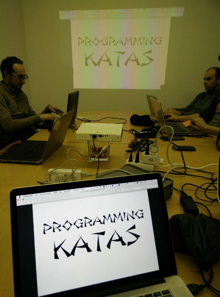

C# Code Kata
############

:date: 2015-01-27 19:00
:tags: meetup
:category: Meetup
:slug: kata1
:authors: Arialdo Martini
:organizer: Gian Carlo Pace
:sommario: Capoccione!

Ci siamo incontrati, ospiti di Roberto Giardina nella sede di `TheDots.ch <http://thedots.ch>`_

Armati di tastiera, in pairing e guidati da `Gian Carlo Pace <https://github.com/gicappa>`_, abbiamo risolto il Code Kata Capoccione_, in C#, applicando Test-Driven Development.

Gian Carlo Pace ha aperto l'incontro con una presentazione molto efficace, usando le slide_ di `Gabriele Lana <https://twitter.com/gabrielelana>`_

.. _Capoccione: http://www.github.com/ticinoxp/capoccione
.. _slide: http://www.slideshare.net/gabriele.lana/programmingkatas

