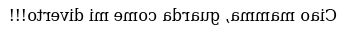

#3 - String reverse
###################

:date: 2018-04-23 22:00
:tags: code-game
:category: Code Games
:slug: string-reverse
:authors: Alessandro Canicatti
:organizer: Alessandro Canicatti
:sommario: In quanti modi (originali) sapresti invertire una stringa?

Questa è una sfida che è venuta in mente ad `Alessandro <http://github.com/ale7canna>`_: trovare modi alternativi, e possibilmente originali e divertenti, per calcolare l'inverso di una stringa.

Tutto è consentito: puoi usare LINQ, magheggi con Excel, incastri di HTML e CSS, Lisp, Kotlin, C#, VBA. Vale anche ServiceNow. Anzi, se qualcuno riesce con ServiceNow vince una birra al giorno, per il resto della sua vita.

Non importa che la soluzione sia efficiente o veloce: vince l'originalità.

Come nel `Paroliere <https://en.wikipedia.org/wiki/Boggle>`_, se due persone propongono la stessa soluzione, si scarta. E come nel Paroliere, non fermarti alla prima soluzione: manda  tutte quelle che ti vengono in mente a `ticinoxp@gmail.com <ticinoxp@gmail.com>`_, o con pull request a `https://github.com/TicinoXP/code-games <https://github.com/TicinoXP/code-games/blob/master/README.md>`_.

Dai dai dai!

Le soluzioni
============

Con Task and Queue (Arialdo)
----------------------------

Una prima soluzione prevede di riempire uno stack con le lettere della stringa, dalla prima all'ultima, per poi ricostruire la stringa con una serie di pop:

.. code-block:: csharp

    public static string Reverse(string str)
    {
        var stack = new Stack<string>();
        str.ToList().ForEach(s => stack.Push(s.ToString()));
        return stack.ToList().Aggregate((a, b) => a + b);
    }

Con una funzione ricorsiva in Haskell (Alessandro)
--------------------------------------------------

Alessandro ha risolto con una funzione ricorsiva, in Haskell:

.. code-block:: haskell

    reverseString x =
      if null x
      then
        []
      else
        reverseString (tail x) ++ [head x]

Ed ecco due versioni alternative, con pattern matching: 

.. code-block:: haskell

    reverseStringPatternMatching [] = []    
    reverseStringPatternMatching x =
      reverseStringPatternMatching (tail x) ++ [head x]
  
    reverseStringGuards x    
      | x == []     = []
      | otherwise   = reverseStringGuards (tail x) ++ [head x]

Con una funzione ricorsiva, in C# (Emanuele)
--------------------------------------------

Emanuele ha trovato indipendentemente la stessa soluzione, e l'ha sviluppata in C#:

.. code-block:: csharp

    public static string Invert(string s)
    {
        if(string.IsNullOrEmpty(s))
            return s;
        if(s.Length == 1)
            return s;
            
        return s.Substring(s.Length - 1, 1) + Invert(s.Substring(0, s.Length - 1));
    }

Lisp (Arialdo)
--------------

Ed ecco lo stesso identico algoritmo, in Scheme:

.. code-block:: scheme

    (define (revs s)
      (cond ((null? s) ())
            (else (append
                   (revs (cdr s))
                   (list (car s))))))

    (display
     (list->string
      (revs (string->list "ciao mamma, guarda come mi diverto"))))
    (newline)

Incomprensibilmente complessa (Emanuele)
----------------------------------------

Da buon matematico, Emanuele propone anche questa seconda soluzione, che alla prima
lettura appare davvero criptica: passa dalla conversione in byte e fa magheggi con gli indici degli array.
Vale la pena leggerla attentamente e capire cosa fa. Ha del geniale, soprattutto perché
ribalta la stringa senza spostare i caratteri:

.. code-block:: csharp

    public static string Invert(string s)
    {
        if(string.IsNullOrEmpty(s))
            return s;

        var array = System.Text.Encoding.ASCII.GetBytes(s);
        var l = array.Length;
                
        for(int i = 0; i < l / 2; i++)
        {
            var diff = array[l - i -1] - array[i];
            array[i] = System.Convert.ToByte(array[i] + diff);
            array[l - i -1] = System.Convert.ToByte(array[l - i -1] - diff);
        }
            
        return System.Text.Encoding.Default.GetString(array);
    }

One liner in LINQ (Emanuele)
----------------------------

Una terza soluzione di Emanuele, in una sola riga di LINQ, con approccio funzionale puro:

.. code-block:: csharp

   String.Concat(System.Linq.Enumerable.Range(0, s.Length)
                 .Select(x => s.ToArray()[s.Length - 1 - x]).ToList())

In CSS (Arialdo)
----------------

Ecco un approccio furbetto in CSS, che sfrutta le proprietà `unicode-bidi` e `direction` di CSS:

.. code-block:: html

   

     Ciao mamma, guarda come mi diverto!
   

con il CSS:

.. code-block:: css

   .reverse {
     unicode-bidi: bidi-override;
     direction: rtl;
   }

Lo potete vedere in funzione su `CodePen <https://codepen.io/anon/pen/MGeLQP>`_.

In CSS, ribaltando anche le lettere (Arialdo)
---------------------------------------------

Sempre in CSS, ma questa volta con il ribaltamento di ogni singola lettera:

.. code-block:: html

   

     Ciao mamma, guarda come mi diverto!!!
   

con il CSS:

.. code-block:: css

   .reverse {
      -webkit-transform:rotateY(180deg);
      -moz-transform:rotateY(180deg);
      -o-transform:rotateY(180deg);
      -ms-transform:rotateY(180deg);
      unicode-bidi:bidi-override;
   }

Potete provarlo su `CodePen <https://codepen.io/anon/pen/MGeLQP>`_.

Reverse Sleep (Arialdo)
-----------------------

Questo è uno spudorato plagio dello Sleep Sort, ma non ho potuto trattenermi:

.. code-block:: csharp

   public static void ReverseSleep(string s)
    {
      var i = 0;
      s.ToList().ForEach(c => Task.Run(() =>
        {
          Thread.Sleep((s.Length - i++) * 100);
          Console.WriteLine(c.ToString());
        }));
    }

Un altro one-liner in LINQ (Arialdo e Alessandro)
-------------------------------------------------

Brutto, ma funziona:

.. code-block:: csharp

   public static string ReverseLinq(string s)
    {
      return string.Join("", s
        .Zip(Enumerable.Range(0, s.Length), 
          (character, index) => new KeyValuePair<int, string>(index, character.ToString()))
        .ToDictionary(x => x.Key, x => x.Value)
        .OrderByDescending(kv => kv.Key)
        .Select(kv => kv.Value));
    }

Service Now!!! (Emanuele e Stefano)
-----------------------------------

E una birra al giorno, vita natural durante, a Emanuele e Stefano!

.. image:: images/game-3-reverse-string/snow.jpg
