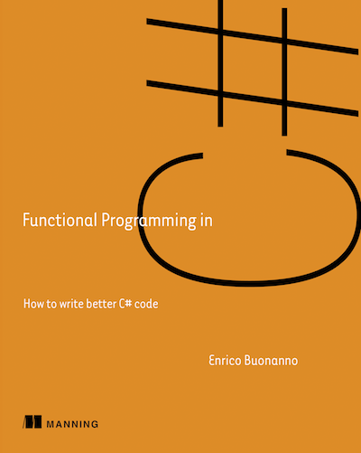

Reading Club - Functional Programming in C#
###########################################

:date: 2021-01-11 08:30
:tags: reading-club
:category: Reading Club
:slug: functional-programming-1
:authors: Arialdo Martini
:organizer: Arialdo Martini
:sommario:  Hey, C# programmers! Let's go functional!

Ciao a tutti!

Con Angelo Monachesi abbiamo pensato di organizzare un gruppo di lettura del libro `Functional Programming in C# <https://www.manning.com/books/functional-programming-in-c-sharp>`_ di Enrico Buonanno.

L'idea è darci dei piccoli obiettivi (niente di troppo impegnativo, uno o due capitoli al mese), e poi di incontrarci (online) ogni 2 o 3 settimane, per vedere di mettere in pratica quel che abbiamo imparato.

Gli incontri non saranno lezioni frontali: ci ritroviamo per confrontarci su quel che abbiamo letto e per mettere in pratica le tecniche che abbiamo imparato.

Per rendere gli incontri concreti, ogni volta ci faremo trovare con qualche bel problema sul quale sfidarci, hands-on-code, e con il quale mettee in esercizio le varie tecniche: immutability, funtori, monoidi, monadi, memoization etc.

Partecipare
===========

Ok, cosa devi fare se vuoi partecipare:

* Iscriviti inviando un messaggio a ticinoxp@gmail.com: nei prossimi giorni fisseremo gli argomenti e gli obietivi per il primo incontro

* Apri `il doodle <https://doodle.com/poll/cp4b2acyzv5f6pq6>`_ e indica tutte le date che possono andarti bene. Fisseremo il primo incontro alla data che dovesse risultare la più votata.

  
* Se vuoi essere aggiunto al gruppo WhatsApp, invia il tuo numero nel messaggio a ticinoxp@gmail.com

  
* Procurati una copia stampata o eBook di `Functional Programming in C# <https://www.manning.com/books/functional-programming-in-c-sharp>`_:

  * Su `Manning <https://www.manning.com/books/functional-programming-in-c-sharp>`_
  * Su `IBS.it <https://www.ibs.it/functional-programming-in-c-how-libro-inglese-enrico-buonanno/e/9781617293955>`_.

    
* Se hai domande, o se vuoi discutere di un argomento, usa liberamente `la sezione Discussions <https://github.com/TicinoXP/functional-programmin-in-csharp/discussions>`_ del repository `su GitHub <https://github.com/TicinoXP/functional-programmin-in-csharp>`_.

* Se vuoi restare aggiornato puoi iscriverti alla `mailing list <https://groups.google.com/g/ticinoxp>`_
  
A presto!
